<center>

# **”YOU ARE BUSTED” Arduino Alarm via Blynk**

## **Project Description**

</center>

In the overall project, we are going to create a movement monitoring system or alarm system. This monitor system can be used for example as a “anti-thef system”. Our Device A will be controlling the proximity sensor and measure the distance of the objects that can go in front of it. 

Device A will be serving as a monitoring system which will raise an alarm if some obstacle is detected closer than 20cm. Alarm message will be sent to the second Device B and lamp will be switched on. At the same time a mobile notification message will be sent to the user and email message.

As a messaging platform will be used Blynk system: (https://blynk.io)


<center>

## **How Blynk Works**
</center>


Blynk was designed for the Internet of Things. It can control hardware remotely, it can display sensor data, it can store data, visualize it and do many other cool things.

There are three major components in the platform:

•	Blynk App - Allows to you create amazing interfaces for your projects using various widgets we provide.

•	Blynk Server - Responsible for all the communications between the smartphone and hardware. You can use our Blynk Cloud or run your private Blynk server locally. It’s open source, could easily handle thousands of devices and can even be launched on a Raspberry Pi.

•	Blynk Libraries - For all the popular hardware platforms - enable communication with the server and process all the incoming and outcoming commands.

Now imagine: every time you press a Button in the Blynk app, the message travels to space the Blynk Cloud, where it magically finds its way to your hardware. It works the same in the opposite direction and everything happens in a blynk of an eye.


Here, you can find all the needed information with more detail: https://docs.blynk.cc/
<center>

## **Components**
</center>

| Hardware  | Quantity | Description | Image |
|:---------------|:---------------:|:-----|:---:|
|Arduino UNO Wifi Rev 2|2|Device A is the distance monitor and device B is the alarm||
|Ultrasonic Distance Sensor - HC-SR04|1|Used for measuring the distance||
|Breadboard Generic|2|Generic breadboard for building the circuits||
|LED Light|1|Any color (we use red)||
|Resistor|1|220 oΩ||
|Cable MINI USB for Arduino|1|Used for uploading code to the Arduinos. It is used only during development. Then power supply can be used.||
|Jumper Wires (generic) Male to Male|9|Different length||
|9V Power Adapter|2|Use power adapter to locate your Arduino in any location without need connecting to your computer. Alternatively  battery based power supply can be used.||
<center>

## 	**APPS and Online Services**
</center>

| Application  | Comment |
|:--------------:|:---------------|
||Used for developing code for Arduino devices. Arduino IDE will be used to fully control the flow of execution. Note that an alternative solution is to use the web editor but due to issues with librairies it will not be done here.|
||Blynk is a hardware-agnostic IoT platform with white-label mobile apps, private clouds, device management, data analytics, and machine learning. Mobile App installation is strongly recommended.|
||Plan your circuit online|
||Alternative to Tinkercad for circuit virtual planning and testing. Plan your circuit offline.|
<center>

## **Blynk Installation**
</center>

Download **Blynk IoT** NEW App in Appstore or Google Play

 			 

Create New Account in Blynk app.

Blynk app for iOS and Android is the easiest way to build your own mobile app that work with the hardware of your choice. 

Account is needed to save your projects and provide access from any smartphone you have.

☝️Use a valid email address as it will be later used often.

☝️After account creation you will receive an email with very useful links to start with.

☝️Blynk user guides for beginners can be found here: https://docs.blynk.cc/#getting-started
<center>

## **Blynk Application: Create templates**
</center>

To create our project we now need to create templates. For that, on Blynk app do the following steps : 

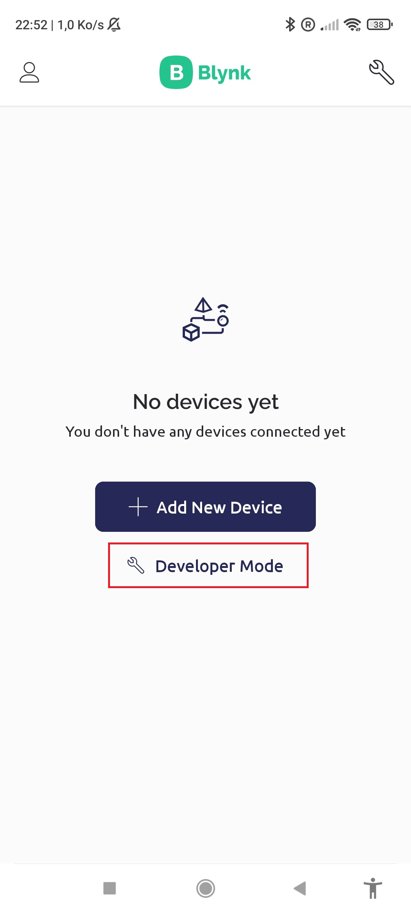
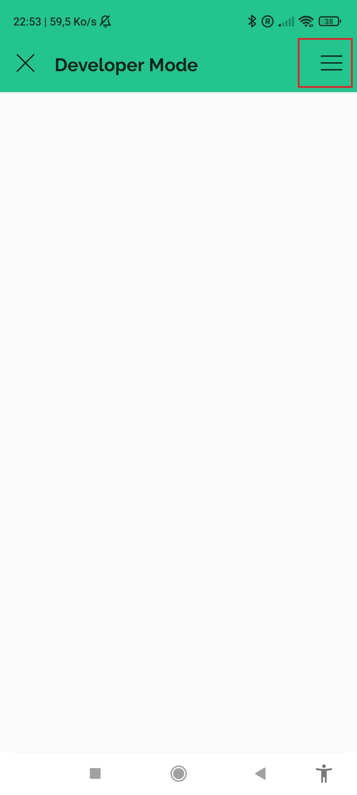
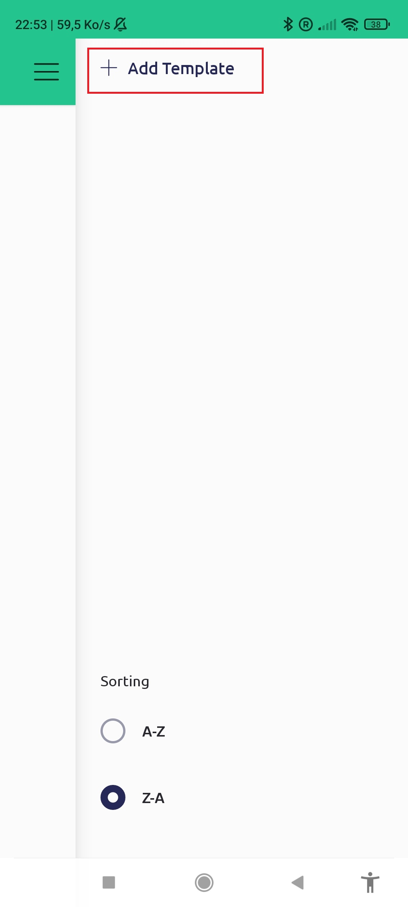


Do the same manipuation again for a second template named Lamp. You should arrive at this point :


<center>

## **Blynk Application: Create and setup the first device**
</center>

Now that all the templates that we will need are created it is time add our frist device, like before follow those steps :


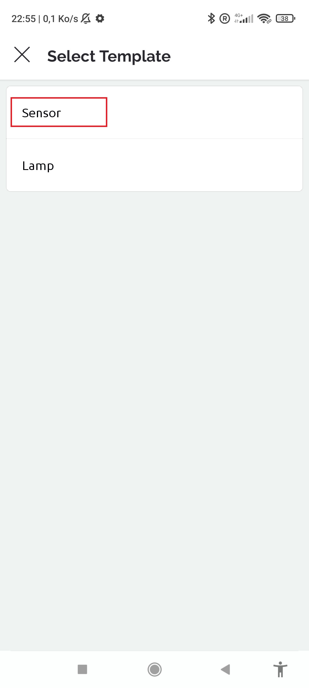


Let’s add Display widget in our Blynk Application. This will serve us as simple value display on our mobile app. This can be used also for testing any value display from our Arduino device and/or for automations.


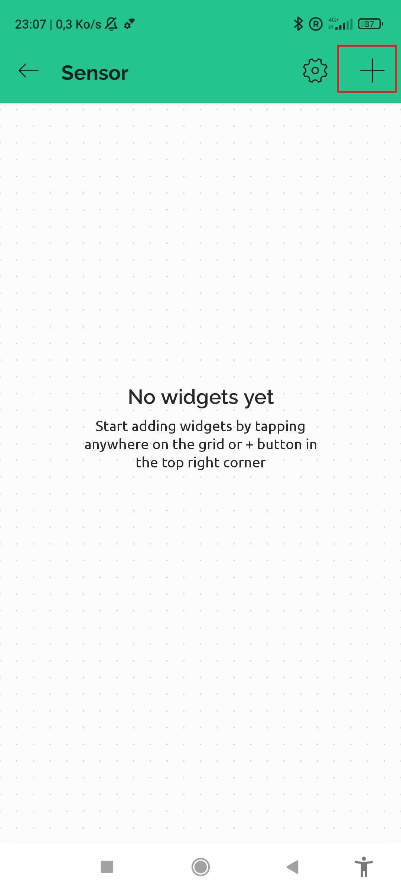

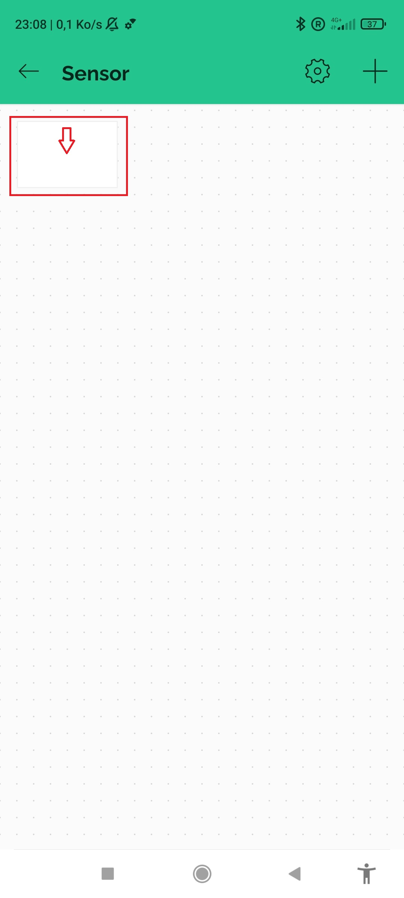

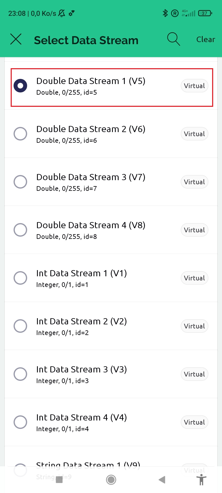
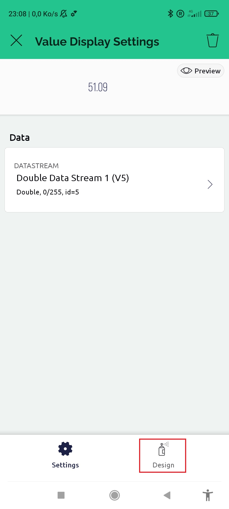
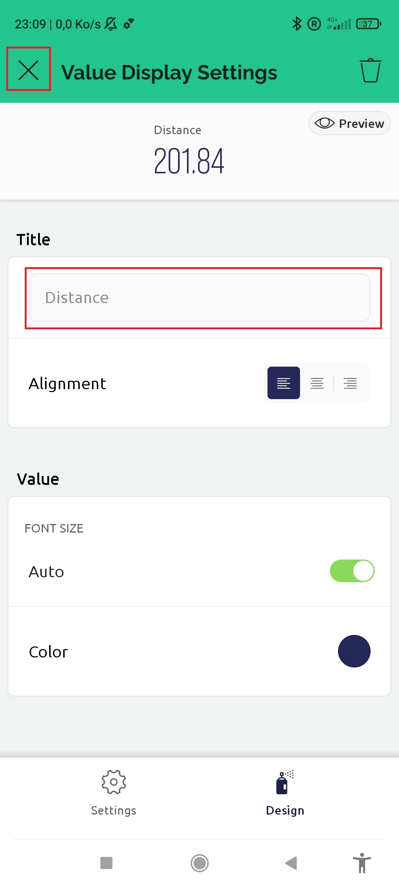


As you had seen many type of data stream are available. Here we choose one that can transfer double (number between 0 and 255) to send the distance detected by the ultrasonic sensor in cm. For now nothing is display because this virtual device is not connected to the real device.

<center>

## **Physical Assembly Device A: Ultrasonic Sensor**
</center>

We need to build following circuit, see below image.

Here is the circuit diagram made using https://www.tinkercad.com. You can also do the same using Fritzing.org. It's free and accessible to all skill levels.


Here you can see the same circuit in real life.


<center>

## **Arduino account, Arduino Create Agent and Arduino IDE**
</center>

Go To https://www.arduino.cc and create an account.

Install Arduino Create Agent here: https://create.arduino.cc/getting-started/plugin/welcome

We need this agent for being able to connect to our device. 

Full manual for this agent installation can be found here: https://support.arduino.cc/hc/en-us/articles/360014869820-How-to-install-the-Arduino-Create-Agent

You will have in the upper part of the computer the Arduino Create Agent. Check is can connect.
 
You then download the IDE. Install the Arduino IDE:
* Download the latest version from: https://www.arduino.cc/en/Main/Software
* Tutorial: https://aprendiendoarduino.wordpress.com/2018/04/03/instalacion-software-arduino-2/

After installation, open the IDE, you should arrive in this windows :


This window will be where we write the code that will be executed on our arduino.

Now make sure that your board is connected to the computer by configuring it so that you get to this display on the IDE: 


<center>

## **Device A (ultrasonic sensor) program development, upload and testing**
</center>

Now we are ready to move our code to Arduino using the IDE.

In the IDE you will have a default sketch open. Sketch is nothing else as a document or file. By default, sketch has 2 main procedures: setup and loop.

Setup is a so-called preparation block and Loop is so called execution block. These are 2 obligatory blocks which you cannot delete, but we can and should modify them. 

In addition, we can add more blocks, procedures, functions, declarations. Here is some useful reference document for Arduino programming: https://www.arduino.cc/reference/en/
You can find tons of good material in internet related to Arduino programming.

So, let’s now develop our program and copy it to our newly created sketch. 

In our code we will need to do following things:
* Add required libraries
* Add handling for Ultrasonic Sensor
* Connect to Wifi
* Connect to Blynk service
* Send data to Blynk using Virtual Pin5 	

Below is the code, which you can just copy and paste to your sketch. You just overwrite whatever it was there in the default sketch.

> **_NOTE:_**  You have to replace the 3 firsts define by yours ! You can find them on https://blynk.cloud/ by logging in with the same credentials than on the app, going in the device and then in Device Info. You also have to modify the wifi credential by your own.

``` c++
/*----------------------------------------------------*/
// This program aims to:
// -Add handling for Ultrasonic Sensor
// -Connect to Wifi
// -Connect to Blynk
// -Send data to Blynk using Virtual Pin5 
//
// MODIFICATION HISTORY
// Person Date Comments
// --------- ------ ---------------------
// Pilar Martin 01/03/2021 Created new
// Billequin Thomas 13/02/2023 Refactor for Blynk update now the logic is handle using automatisation on Blynk
// 
/*----------------------------------------------------*/
#define BLYNK_TEMPLATE_ID ""
#define BLYNK_TEMPLATE_NAME ""
#define BLYNK_AUTH_TOKEN ""

/* Comment this out to disable prints and save space */
#define BLYNK_PRINT Serial
#define BLYNK_MAX_SENDBYTES 1000 // this is to override default max message size

// Include required libraries
#include <Blynk.h>
#include <SPI.h>
#include <WiFi.h>
#include <BlynkSimpleWifi.h>

// define digital pins for the Ultrasonic Sensor
#define trigPin 7
#define echoPin 6

// Your WiFi credentials.
// Set password to "" for open networks.
char ssid[] = "";
char pass[] = "";

// Timer for blynking
BlynkTimer timer;

// This custom function sends Arduino's up time every second to Virtual Pin (5).
// In the app, Widget's reading frequency should be set to PUSH. This means
// that you define how often to send data to Blynk App.
void sendSensor()
{
 long durationindigit, distanceincm;
 
 // processing Ultrasonic Data and calculating the distance
 digitalWrite(trigPin, LOW);
 delayMicroseconds(2);
 digitalWrite(trigPin, HIGH);
 delayMicroseconds(10);
 digitalWrite(trigPin, LOW);
 durationindigit = pulseIn(echoPin, HIGH);
 //distanceincm = (durationindigit * 0.034) / 2;
 distanceincm = (durationindigit/2) / 29.1;
 
 // checking if any value is retrieved
 // printing results to the serial port output (for debugging, can be commented out later)
 if (isnan(distanceincm)) {

  Serial.println("Failed to read from sensor!");
  return;

 } else {
 
 Serial.print(distanceincm);
 Serial.println(" cm");
 
 // Lets send value to Blynk
 // You can send any value at any time.
 // Please don't send more that 10 values per second.
 Blynk.virtualWrite(V5, distanceincm);
 }
}

void setup()
{
 // Debug console
 Serial.begin(9600);
 Blynk.begin(BLYNK_AUTH_TOKEN, ssid, pass);
 // You can also specify server:
 //Blynk.begin(auth, ssid, pass, "blynk-cloud.com", 80);
 //Blynk.begin(auth, ssid, pass, IPAddress(192,168,1,100), 8080);
 
 while (Blynk.connect() == false) {
 // Wait until Blynk is connected
 }
 
 pinMode(trigPin, OUTPUT);
 pinMode(echoPin, INPUT);
 
 // Setup a function to be called every second
 timer.setInterval(1000L, sendSensor);
 
}
void loop()
{
 Blynk.run();
 // You can inject your own code or combine it with other sketches.
 // Check other examples on how to communicate with Blynk. Remember
 // to avoid delay() function!
 timer.run();
 
}
```

After copying your code to the sketch in Arduino Web Editor you can save your sketch and Verify the code by pressing < Verify and Save > button. 
> **_NOTE 1 :_** If some error pop saying that librairies are missing, install them using the librairie manager of the IDE.  


> **_NOTE 2 :_**  If you get the error “atoll” was not declared in this scope you have 2 choices :
> * Modify the file of the librairie directly on your computer to fix the issue by replacing atoll to atol in the given file.
> * Change the version of Blynk librairie to version 0.6.1.

If you don't get any error you can now send your program on the arduino by simply clicking on the < Upload > button next to the previous one. Now to visualize what is happening open the serial monitor (Tools > Serial Monitor). After some time (could take 1 or 2 minutes for the first connection), if everything work well you should see this :


> **_NOTE :_** If nothing happenend verify take the internet network where you want to connect the device is working.

You can now disconnect the device from the computer and connect it using the power adapter.

<center>

## **Now device B**
</center>

Now like with the sensor we will add the lamp device on Blynk, don't forget to use the lamp template that we create before ! 

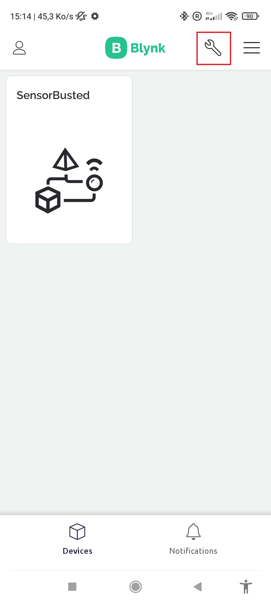
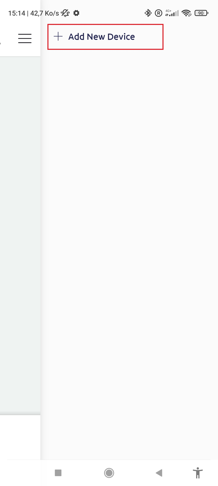

You now have your 2 devices on the app.


We need to build following circuit, see image below (created using: https://www.tinkercad.com/). Remember the small leg of the led is going to the GND.


Here you can see the same circuit in real life.


Now you can go on  https://blynk.cloud/  to get its token, id and name that we will used in our program. Don't forget to put credentials of the network too.

``` c++
/*----------------------------------------------------*/
// This program aims to:
// - Add handling for Led Lamp
// - Connect to Wifi
// - Connect to Blynk
// - Receive data from Blynk 
//
// MODIFICATION HISTORY
// Person Date Comments
// --------- ------ ---------------------
// Pilar Martin 01/03/2021 Created new
// Billequin Thomas 13/02/2023 Refactor for Blynk update now the logic is handle using automatisation on Blynk
// 
/*----------------------------------------------------*/
#define BLYNK_TEMPLATE_ID ""
#define BLYNK_TEMPLATE_NAME ""
#define BLYNK_AUTH_TOKEN ""

/* Comment this out to disable prints and save space */
#define BLYNK_PRINT Serial
#define PIN 10

#include <Blynk.h>
#include <SPI.h>
#include <WiFi.h>
#include <BlynkSimpleWifi.h>
// You should get Auth Token in the Blynk App.
// Go to the Project Settings (nut icon).
// Your WiFi credentials.
// Set password to "" for open networks.
char ssid[] = "";
char pass[] = "";
void setup ()
{
 // Debug console
 Serial.begin(9600);
 
 pinMode (PIN, OUTPUT); // Initialization of the LED output pin
 
 Blynk.begin(BLYNK_AUTH_TOKEN, ssid, pass);
 // You can also specify server:
 //Blynk.begin(auth, ssid, pass, "blynk-cloud.com", 80);
 //Blynk.begin(auth, ssid, pass, IPAddress(192,168,1,100), 8080);
}
void loop () // main program loop
{
  Blynk.run();
 // You can inject your own code or combine it with other sketches.
 // Check other examples on how to communicate with Blynk. Remember
 // to avoid delay() function!
}

//Is called every time Virtual Pin 5 of Blynk is updated
BLYNK_WRITE(V5){
  //read the value of the virtual pin
  if(param.asInt() > 128)
  {
    // execute this code if the switch widget is now ON
    Serial.println("on");
    digitalWrite(PIN,HIGH);  // Set digital pin HIGH
  }
  else
  {
    // execute this code if the switch widget is now OFF
    Serial.println("off");
    digitalWrite(PIN,LOW);  // Set digital pin LOW    
  }
}
```

You can now like before verify the code and then upload it on the device. When it's done nothing should happened on the IDE but you can see if it connect to Blynk if the device is not marked a **Offline** on the app.

Now to start to comminicate with this device we can use widget. Here we will add a button to control the light :


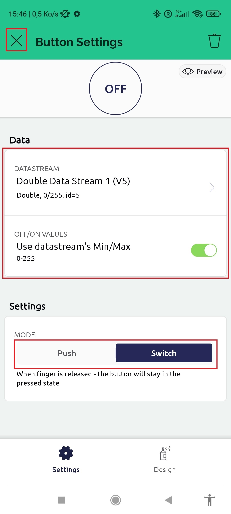


You should now be able to controle the light of your device using the widget button.

<center>

## **Automations**
</center>

Now that we setup both of our devices we need to make them communicate through the IOT platform using in that case Automations. Here you can find the documentation :
*  https://docs.blynk.io/en/concepts/automations

To enable automation go on https://blynk.cloud/ -> Template section -> Sensor template -> Automations -> Edit. You should arrive on that page :

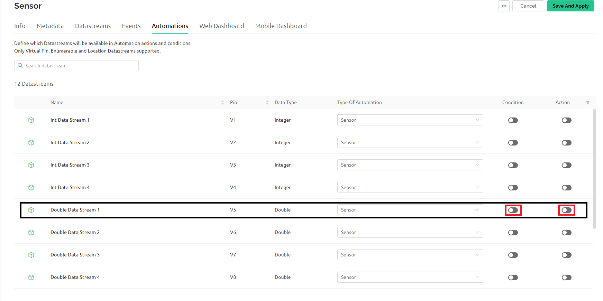

Now enable condition and action for V5. It's where we write the data of the sensor. Save and reload the page and the app. Do the exact same for the other template. You can now see Automation on both of them, but we will focus on the app : 


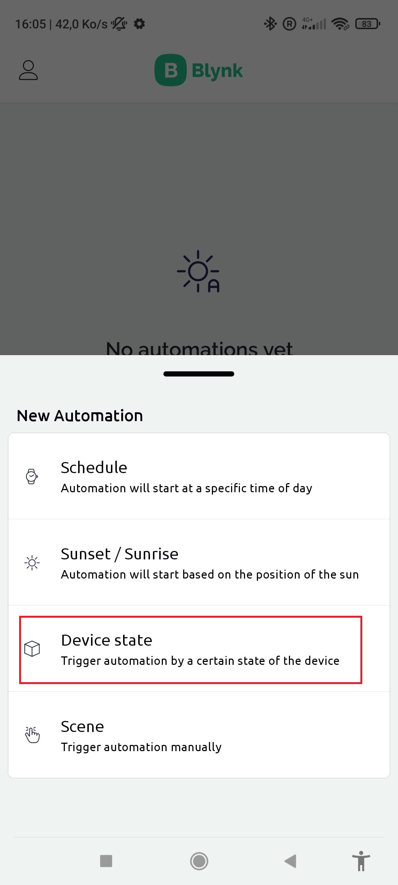
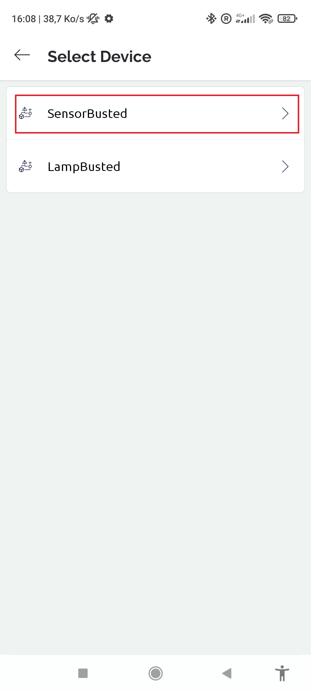

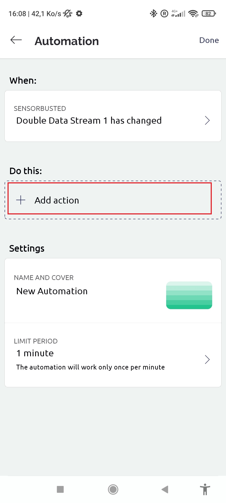

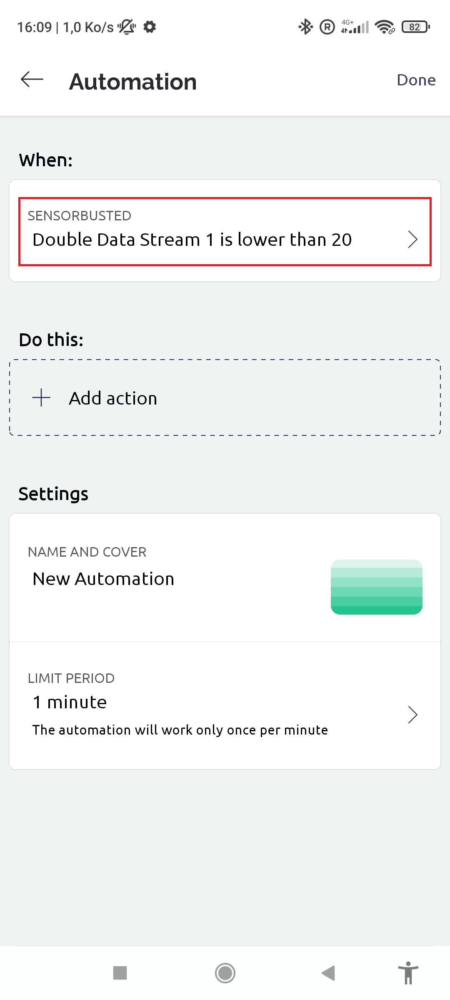
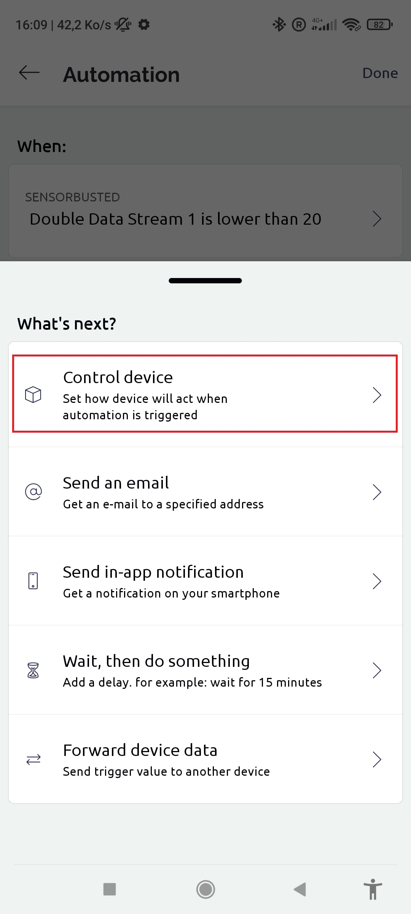


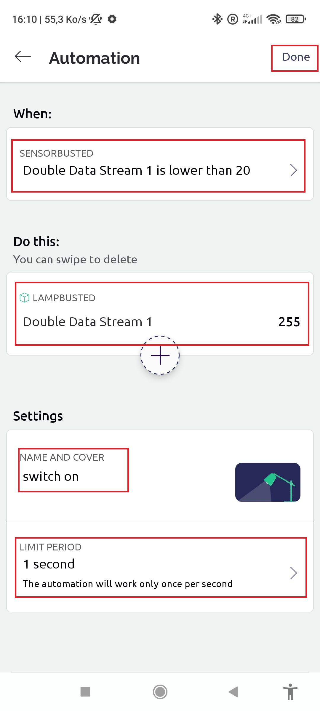

You now have create a automation that switch on the light when you are close enough of the sensor but it never switch off ! We will now resolve this problem with another automation : 


Now both of your automations are done ! You should see something like that :


